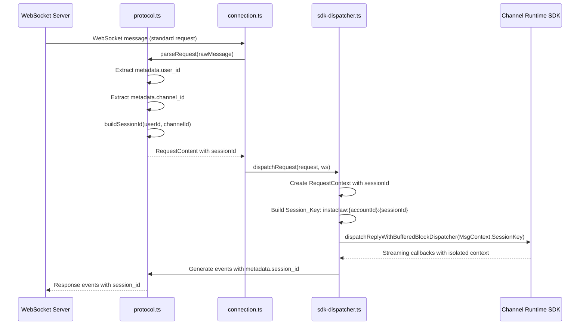

# Design Document: Session-Based User Isolation

## Overview

This design implements OpenClaw's `per-channel-peer` isolation mode for the InstaClaw Connector plugin. The feature ensures that different users within the same channel maintain separate AI conversation contexts by constructing session identifiers that include both `channelId` and `userId`.

The implementation follows OpenClaw's official guidance that Channel plugins are responsible for **Session grammar** — mapping provider-specific conversation IDs to base chats, thread IDs, and parent fallbacks. The plugin extracts user identity from inbound messages, constructs session identifiers in the format `channel:{channelId}:user:{userId}`, and passes these to the SDK to ensure conversation isolation.

### Key Design Principles

1. **Identity Extraction**: Extract `userId` and `channelId` from every inbound message's metadata
2. **Session Construction**: Build deterministic session identifiers combining channel and user dimensions
3. **SDK Integration**: Pass session identifiers through the entire request lifecycle to the SDK
4. **Backward Compatibility**: Maintain existing functionality while adding user isolation
5. **Error Handling**: Fail fast with clear diagnostics when identity fields are missing

## Architecture

### Component Interaction Flow



### Data Flow

1. **Inbound Message** → Contains `metadata.user_id` and `metadata.channel_id`
2. **Protocol Parsing** → Extracts identity fields and constructs `sessionId`
3. **Request Context** → Carries `sessionId` through request lifecycle
4. **SDK Dispatch** → Converts `sessionId` to `Session_Key` format for SDK
5. **Response Events** → Include `metadata.session_id` for routing

## Components and Interfaces

### 1. Protocol Module (protocol.ts)

#### New Function: buildSessionId

```typescript
/**
 * Build session identifier from userId and channelId
 * 
 * Constructs a deterministic session identifier in the format:
 * channel:{channelId}:user:{userId}
 * 
 * This implements OpenClaw's per-channel-peer isolation mode.
 * 
 * @param userId - User identifier (will be converted to string)
 * @param channelId - Channel identifier (will be converted to string)
 * @returns Session identifier string
 */
export function buildSessionId(userId: string | number, channelId: string | number): string {
  return `channel:${String(channelId)}:user:${String(userId)}`;
}
```

#### Modified Function: parseRequest

The `parseRequest` function will be enhanced to:

1. Validate presence of `metadata.user_id` field
2. Validate presence of `metadata.channel_id` field
3. Call `buildSessionId` to construct session identifier
4. Include `sessionId` in returned `RequestContent`

**Error Handling**:
- Throw descriptive error if `metadata.user_id` is missing or non-string
- Throw descriptive error if `metadata.channel_id` is missing or non-string
- Include message preview in error for diagnostics

#### Modified Event Creation Functions

All event creation functions that currently accept optional `sessionId` parameter will continue to support it:

- `createInProgressEvent(responseId, sessionId?)`
- `createCompletedEvent(responseId, sessionId?)`
- `createFailedEvent(responseId, code, message, details, sessionId?)`
- `createCompleteResponse(responseId, itemId, text, sessionId)`

When `sessionId` is provided, these functions include it in `metadata.session_id` field of the event.

### 2. SDK Dispatcher Module (sdk-dispatcher.ts)

#### Modified Interface: RequestContext

```typescript
export interface RequestContext {
  /** Original request message ID from WebSocket envelope */
  messageId: string;
  
  /** Generated response ID for Open Responses protocol */
  responseId: string;
  
  /** Generated item ID for the response item */
  itemId: string;
  
  /** Request content text */
  content: string;
  
  /** Timestamp when request was received */
  requestTimestamp: number;
  
  /** Accumulated response text buffer */
  responseBuffer: string;
  
  /** Whether the first chunk has been received */
  firstChunkReceived: boolean;
  
  /** Timeout timer reference */
  timeoutTimer: NodeJS.Timeout | null;
  
  /** AbortController for cancelling SDK operation on timeout */
  abortController: AbortController | null;
  
  /** Request status */
  status: 'pending' | 'processing' | 'completed' | 'failed' | 'timeout';
  
  /** WebSocket connection reference for sending events */
  ws: WebSocket;
  
  /** Streaming flag for response mode selection */
  stream: boolean;
  
  /** Session identifier for routing (NEW) */
  sessionId: string;
}
```

#### Modified Method: dispatchRequest

The `dispatchRequest` method will be updated to:

1. Accept `sessionId` field in request parameter
2. Store `sessionId` in `RequestContext`
3. Pass `sessionId` to `realSDKDispatch` for Session_Key construction

#### Modified Method: realSDKDispatch

The `realSDKDispatch` method will construct the SDK Session_Key:

```typescript
private async realSDKDispatch(
  content: string,
  callback: SDKCallback,
  signal?: AbortSignal,
  sessionId?: string
): Promise<void> {
  // Build MsgContext with SessionKey
  const msgCtx = {
    Body: content,
    AccountId: this.accountId,
    SessionKey: this.buildSessionKey(sessionId),
  };
  
  // ... rest of implementation
}

private buildSessionKey(sessionId?: string): string {
  if (!sessionId) {
    return this.accountId ? `instaclaw:${this.accountId}` : 'instaclaw:default';
  }
  
  if (this.accountId) {
    return `instaclaw:${this.accountId}:${sessionId}`;
  }
  
  return `instaclaw:default:${sessionId}`;
}
```

#### Modified Event Generation Methods

All event generation methods will pass `context.sessionId` to protocol event creation functions:

- `generateInProgressEvent(context)` → calls `createInProgressEvent(context.responseId, context.sessionId)`
- `generateCompletedEvent(context)` → calls `createCompletedEvent(context.responseId, context.sessionId)`
- `generateFailedEvent(context, ...)` → calls `createFailedEvent(..., context.sessionId)`
- `generateCompleteResponse(context)` → calls `createCompleteResponse(..., context.sessionId)`

### 3. Type Definitions (types.ts)

#### Modified Interface: RequestContent

```typescript
export interface RequestContent {
  /** User message content */
  content: string;
  /** Message ID from envelope.headers.messageId */
  messageId: string;
  /** Topic from envelope.headers.topic */
  topic: string;
  /** Session identifier from request metadata.session_id (NEW) */
  sessionId: string;
  /** Streaming flag from request.stream */
  stream: boolean;
  /** Model identifier from request.model (optional) */
  model?: string;
  /** Any additional header values */
  [key: string]: any;
}
```

## Data Models

### Session Identifier Format

```
channel:{channelId}:user:{userId}
```

**Examples**:
- `channel:room-123:user:alice`
- `channel:dm-456:user:bob`
- `channel:group-789:user:charlie`

**Properties**:
- Deterministic: Same inputs always produce same output
- Unique per user-channel pair: Different users in same channel get different IDs
- Consistent per user: Same user in same channel always gets same ID
- String-safe: All components converted to strings

### SDK Session Key Format

```
instaclaw:{accountId}:{sessionId}
```

**Examples**:
- `instaclaw:acc-001:channel:room-123:user:alice`
- `instaclaw:default:channel:room-123:user:bob` (when accountId is undefined)

**Fallback Behavior**:
- If `sessionId` is undefined: `instaclaw:{accountId}` or `instaclaw:default`
- If `accountId` is undefined: `instaclaw:default:{sessionId}`

### Request Metadata Structure

```json
{
  "model": "gpt-4",
  "stream": true,
  "input": [
    {
      "role": "user",
      "content": [
        {
          "type": "text",
          "text": "Hello"
        }
      ]
    }
  ],
  "metadata": {
    "session_id": "channel:room-123:user:alice",
    "user_id": "alice",
    "channel_id": "room-123",
    "message_id": "msg_001"
  }
}
```

### Response Event Metadata

```json
{
  "type": "response.completed",
  "response_id": "resp_123",
  "status": "completed",
  "timestamp": "2026-03-25T08:00:00Z",
  "metadata": {
    "session_id": "channel:room-123:user:alice"
  }
}
```

## Error Handling

### Missing User ID

**Condition**: `metadata.user_id` field is missing, null, or non-string

**Action**:
```typescript
throw new Error('Invalid request: missing or non-string metadata.user_id');
```

**Logging**:
```typescript
logger.error('Failed to parse user request', error, {
  message_preview: rawMessage.substring(0, 100),
  message_length: rawMessage.length,
  error_name: error.name,
  error_message: error.message,
});
```

### Missing Channel ID

**Condition**: `metadata.channel_id` field is missing, null, or non-string

**Action**:
```typescript
throw new Error('Invalid request: missing or non-string metadata.channel_id');
```

**Logging**: Same as Missing User ID

### SDK Dispatch Failure

**Condition**: SDK dispatch fails with user-isolated session

**Action**:
1. Generate `response.failed` event with `metadata.session_id`
2. Log error with `userId`, `channelId`, and `sessionId`
3. Clean up request context
4. Do not affect other users' requests

**Isolation**: Each user's request context is independent; failures in one user's request do not impact others.

### Timeout Handling

**Condition**: Request exceeds timeout threshold

**Action**:
1. Generate `response.failed` event with error code "TIMEOUT"
2. Include `metadata.session_id` in failed event
3. Abort SDK operation via AbortController
4. Clean up only the timed-out user's context
5. Log timeout with `sessionId` for diagnostics

## Testing Strategy

### Unit Tests

**Test File**: `tests/unit/session-isolation.test.ts`

1. **buildSessionId Function Tests**
   - Same userId + channelId → same sessionId
   - Different userId, same channelId → different sessionId
   - Same userId, different channelId → different sessionId
   - Type coercion: number inputs converted to strings
   - Edge cases: empty strings, special characters

2. **parseRequest Tests**
   - Valid request with user_id and channel_id → success
   - Missing user_id → throws error
   - Missing channel_id → throws error
   - Non-string user_id → throws error
   - Non-string channel_id → throws error
   - sessionId included in returned RequestContent

3. **SDK Dispatcher Tests**
   - RequestContext includes sessionId field
   - Session_Key constructed correctly with accountId
   - Session_Key constructed correctly without accountId
   - Different users get different Session_Keys
   - Same user gets same Session_Key across requests

4. **Event Generation Tests**
   - in_progress event includes metadata.session_id
   - completed event includes metadata.session_id
   - failed event includes metadata.session_id
   - complete response includes metadata.session_id

### Integration Tests

**Test File**: `tests/integration/user-isolation.test.ts`

1. **Multi-User Scenario**
   - User A sends message in channel X
   - User B sends message in channel X
   - Verify different Session_Keys used
   - Verify responses include correct session_id

2. **Same User Continuity**
   - User A sends first message in channel X
   - User A sends second message in channel X
   - Verify same Session_Key used
   - Verify session_id consistent across responses

3. **Cross-Channel Isolation**
   - User A sends message in channel X
   - User A sends message in channel Y
   - Verify different Session_Keys used
   - Verify different session_ids in responses

4. **Error Isolation**
   - User A's request times out
   - User B's request completes successfully
   - Verify User B unaffected by User A's timeout

### Property-Based Tests

Property-based testing is **not applicable** for this feature because:

1. **Infrastructure Integration**: The feature primarily integrates with external SDK and WebSocket infrastructure, not pure functions
2. **Side-Effect Operations**: Session management involves stateful operations (SDK dispatch, WebSocket communication)
3. **Configuration Validation**: Most logic validates configuration and constructs identifiers, better suited for example-based tests

**Alternative Testing Approach**:
- Use example-based unit tests for identifier construction logic
- Use integration tests with mocks for SDK interaction
- Use snapshot tests for event structure validation

## Logging and Diagnostics

### Request Parsing

```typescript
logger.info('Parsed user request', {
  messageId: request.messageId,
  topic: request.topic,
  sessionId: request.sessionId,
  userId: metadata.user_id,
  channelId: metadata.channel_id,
  contentLength: request.content.length,
});
```

### SDK Dispatch

```typescript
logger.info('Dispatching request to SDK', {
  messageId: request.messageId,
  responseId: context.responseId,
  sessionId: request.sessionId,
  sessionKey: msgCtx.SessionKey,
  contentLength: request.content.length,
  activeRequests: this.getActiveRequestCount(),
});
```

### Event Generation

```typescript
logger.debug('Sent response.in_progress event', {
  messageId: context.messageId,
  responseId: context.responseId,
  sessionId: context.sessionId,
});
```

### Request Completion

```typescript
logger.info('Request completed successfully', {
  messageId: context.messageId,
  responseId: context.responseId,
  sessionId: context.sessionId,
  responseLength: context.responseBuffer.length,
  duration: Date.now() - context.requestTimestamp,
  stream: context.stream,
});
```

### Context Cleanup

```typescript
logger.debug('Context cleaned up', {
  messageId: context.messageId,
  responseId: context.responseId,
  sessionId: context.sessionId,
  status: context.status,
  activeRequests: this.getActiveRequestCount(),
});
```

## Backward Compatibility

### Existing Tests

All existing tests must be updated to provide `metadata.user_id` and `metadata.channel_id` fields in test requests. Tests that use the old format without these fields will fail with clear error messages.

**Migration Strategy**:
1. Update test fixtures to include metadata fields
2. Update mock request builders to include identity fields
3. Verify all existing tests pass with new format

### Optional sessionId Parameter

Event creation functions maintain optional `sessionId` parameter for backward compatibility:

```typescript
createInProgressEvent(responseId: string, sessionId?: string)
```

When `sessionId` is not provided, events are generated without `metadata` field, maintaining compatibility with code that doesn't use session isolation.

### Graceful Degradation

If `metadata.user_id` or `metadata.channel_id` is missing, the system fails fast with a clear error message rather than silently using a default value. This prevents accidental context sharing and makes misconfiguration immediately visible.

## Implementation Notes

### Thread Support

The current design does **not** include Thread support as specified in requirements. If Thread support is needed in the future:

1. Extract `metadata.thread_id` from request
2. Modify `buildSessionId` to accept optional `threadId` parameter
3. Update session format to: `channel:{channelId}:user:{userId}:thread:{threadId}`
4. Ensure thread isolation doesn't override user isolation

### Performance Considerations

- **Session ID Construction**: O(1) string concatenation, negligible overhead
- **Context Lookup**: O(1) Map lookup by messageId
- **Memory**: Each RequestContext stores sessionId string (~50-100 bytes)
- **Concurrency**: Independent contexts per user enable true parallel processing

### Security Considerations

- **Identity Validation**: Strict validation prevents empty or malformed identifiers
- **Context Isolation**: Each user's context is completely independent
- **Error Isolation**: Failures in one user's request don't affect others
- **Logging**: All operations logged with sessionId for audit trail

## Migration Path

### Phase 1: Add Session ID Construction (Current Spec)

1. Implement `buildSessionId` function in protocol.ts
2. Update `parseRequest` to extract identity and construct sessionId
3. Update `RequestContent` interface to include sessionId
4. Update all tests to provide identity fields

### Phase 2: SDK Integration (Current Spec)

1. Update `RequestContext` to include sessionId
2. Modify `dispatchRequest` to pass sessionId
3. Implement `buildSessionKey` in SDK dispatcher
4. Update `realSDKDispatch` to use Session_Key

### Phase 3: Event Metadata (Current Spec)

1. Update event generation methods to pass sessionId
2. Verify all response events include metadata.session_id
3. Add integration tests for end-to-end session flow

### Phase 4: Validation and Rollout

1. Run full test suite
2. Verify logging includes sessionId in all operations
3. Test multi-user scenarios
4. Deploy to production

## Future Enhancements

### Thread Support

Add optional thread dimension to session identifiers:
- Format: `channel:{channelId}:user:{userId}:thread:{threadId}`
- Maintain user isolation as primary dimension
- Thread as secondary dimension within user context

### Session Analytics

Track session metrics:
- Active sessions per channel
- Session duration per user
- Request count per session
- Context size per session

### Session Persistence

Implement session state persistence:
- Save session history to database
- Restore session context on reconnection
- Implement session expiration policies
