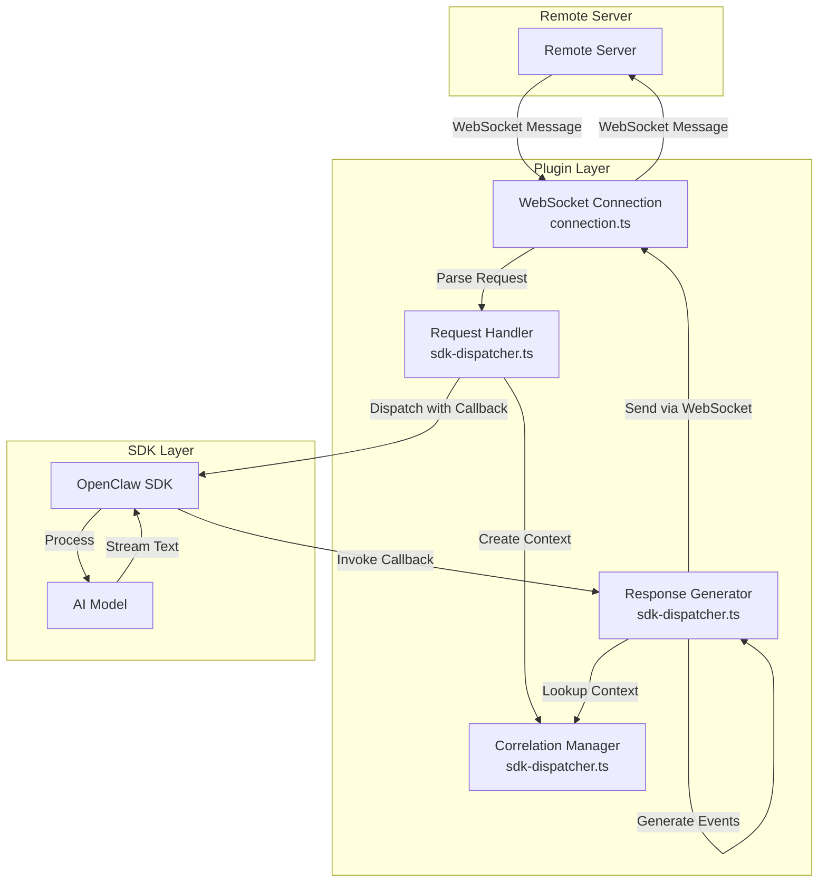
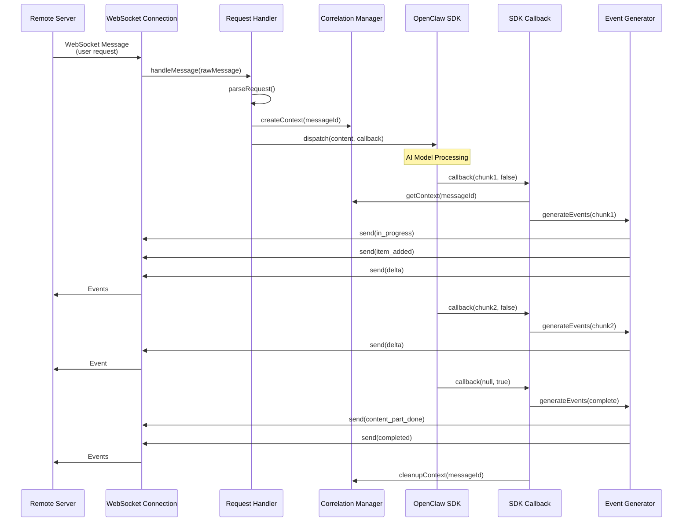

# Design Document: WebSocket-SDK Communication Core

## Overview

This design document specifies the architecture and implementation details for the core WebSocket-SDK communication logic in the InstaClaw Connector plugin. The system enables bidirectional communication between a remote server and the OpenClaw SDK through a plugin intermediary.

### Architecture Pattern

The plugin acts as a **protocol adapter** and **request responder** that bridges two different communication paradigms:

```
Remote Server ←(WebSocket/Open Responses)→ Plugin ←(Function Call/Callback)→ OpenClaw SDK
```

- **Server ↔ Plugin**: Asynchronous WebSocket communication using Open Responses protocol
- **Plugin ↔ SDK**: Synchronous function calls with asynchronous callback-based streaming responses

### Key Design Principles

1. **Protocol Isolation**: WebSocket protocol logic (connection.ts, protocol.ts) is separated from SDK integration logic
2. **Request-Response Correlation**: Each request maintains correlation context throughout its lifecycle
3. **Streaming Response Handling**: SDK callbacks are converted to Open Responses event sequences in real-time
4. **Concurrent Request Support**: Multiple requests can be processed simultaneously with independent state
5. **Error Isolation**: Failures in one request-response cycle do not affect other concurrent operations

### Scope

This design covers:
- SDK integration interface and dispatch mechanism
- Request reception and parsing from WebSocket
- SDK callback handling and response collection
- Response event generation and transmission
- Request-response correlation tracking
- Error handling and timeout management
- Concurrent request handling

This design does NOT cover:
- WebSocket connection management (already implemented in connection.ts)
- Open Responses protocol event structures (already implemented in protocol.ts)
- Plugin registration and configuration (already implemented in channel.ts)

## Architecture

### Component Diagram



### Data Flow Sequence



### Module Structure

The implementation will be organized into the following modules:


**sdk-dispatcher.ts** (NEW)
- Request handler and dispatcher
- Correlation context management
- SDK callback implementation
- Response event generation orchestration
- Timeout management

**connection.ts** (EXISTING - MODIFY)
- Add SDK dispatcher integration
- Route user messages to SDK dispatcher
- Keep existing WebSocket management logic

**protocol.ts** (EXISTING - NO CHANGES)
- Event creation helpers (already implemented)
- Envelope wrapping (already implemented)
- Request parsing (already implemented)

**types.ts** (EXISTING - EXTEND)
- Add SDK-related type definitions
- Add correlation context types
- Add callback interface types

## Components and Interfaces

### SDK Dispatcher Module (sdk-dispatcher.ts)

This is the core new module that implements the SDK integration logic.

#### Request Context Interface

```typescript
/**
 * Correlation context for tracking request-response lifecycle
 */
interface RequestContext {
  /** Original request message ID from WebSocket envelope */
  messageId: string;
  
  /** Generated response ID for Open Responses protocol */
  responseId: string;
  
  /** Generated item ID for the response item */
  itemId: string;
  
  /** Request content text */
  content: string;
  
  /** Timestamp when request was received */
  requestTimestamp: number;
  
  /** Accumulated response text buffer */
  responseBuffer: string;
  
  /** Whether the first chunk has been received */
  firstChunkReceived: boolean;
  
  /** Timeout timer reference */
  timeoutTimer: NodeJS.Timeout | null;
  
  /** Request status */
  status: 'pending' | 'processing' | 'completed' | 'failed' | 'timeout';
  
  /** WebSocket connection reference for sending events */
  ws: WebSocket;
}
```

#### SDK Callback Interface

```typescript
/**
 * Callback function signature for SDK streaming responses
 * 
 * The SDK invokes this callback multiple times during response generation:
 * - For each text chunk: callback(chunk, null, false)
 * - On completion: callback(null, null, true)
 * - On error: callback(null, error, false)
 */
type SDKCallback = (
  chunk: string | null,
  error: Error | null,
  isComplete: boolean
) => void;
```

#### SDK Dispatcher Class

```typescript
/**
 * SDK Dispatcher
 * 
 * Manages the lifecycle of SDK requests and responses:
 * - Receives parsed requests from WebSocket handler
 * - Creates correlation contexts
 * - Dispatches requests to SDK with callbacks
 * - Handles streaming responses via callbacks
 * - Generates and sends Open Responses events
 * - Manages timeouts and cleanup
 */
class SDKDispatcher {
  /** Active request contexts indexed by messageId */
  private contexts: Map<string, RequestContext>;
  
  /** Logger instance */
  private logger: DebugLogger;
  
  /** Configuration */
  private config: {
    requestTimeout: number;
    maxConcurrentRequests: number;
    debug: boolean;
  };
  
  constructor(config: DispatcherConfig, logger: DebugLogger);
  
  /**
   * Dispatch a request to the SDK
   * 
   * Creates correlation context, sets up timeout, and calls SDK dispatch method
   * with a callback closure that captures the context.
   */
  async dispatchRequest(
    request: RequestContent,
    ws: WebSocket
  ): Promise<void>;
  
  /**
   * Create SDK callback for a specific request context
   * 
   * Returns a callback function that:
   * - Looks up the correlation context
   * - Accumulates text chunks
   * - Generates appropriate Open Responses events
   * - Sends events via WebSocket
   * - Handles completion and errors
   */
  private createCallback(messageId: string): SDKCallback;
  
  /**
   * Handle text chunk from SDK callback
   */
  private handleChunk(
    context: RequestContext,
    chunk: string
  ): void;
  
  /**
   * Handle completion from SDK callback
   */
  private handleCompletion(context: RequestContext): void;
  
  /**
   * Handle error from SDK callback
   */
  private handleError(
    context: RequestContext,
    error: Error
  ): void;
  
  /**
   * Handle request timeout
   */
  private handleTimeout(messageId: string): void;
  
  /**
   * Clean up request context
   */
  private cleanupContext(messageId: string): void;
  
  /**
   * Get active request count
   */
  getActiveRequestCount(): number;
}
```

### SDK Integration Interface

The plugin needs to integrate with the OpenClaw SDK. Based on the requirements and the existing OpenClaw plugin SDK patterns, the SDK integration will use the following approach:

```typescript
/**
 * SDK Dispatch Method Interface
 * 
 * This is the interface we expect from the OpenClaw SDK for processing requests.
 * The actual implementation will be provided by the OpenClaw SDK.
 */
interface SDKDispatchMethod {
  /**
   * Dispatch a request to the SDK for processing
   * 
   * @param content - Request content text
   * @param callback - Callback for streaming response
   * @param options - Optional dispatch options (system prompt, etc.)
   * @returns Promise that resolves when dispatch is initiated (not when complete)
   */
  (
    content: string,
    callback: SDKCallback,
    options?: {
      systemPrompt?: string;
      accountId?: string;
    }
  ): Promise<void>;
}
```

### Integration with Existing Modules

#### connection.ts Modifications

The `handleMessage` function in `connection.ts` will be modified to route user messages to the SDK dispatcher:

```typescript
// In monitorInstaClawProvider function
async function handleMessage(rawMessage: string): Promise<void> {
  try {
    const { parseRequest, TOPIC_USER_MESSAGES } = await import('./protocol.js');
    const { SDKDispatcher } = await import('./sdk-dispatcher.js');
    
    // Parse envelope to determine routing
    let topic: string | undefined;
    try {
      const peek = JSON.parse(rawMessage);
      topic = peek?.headers?.topic;
    } catch {
      // malformed JSON
    }
    
    // Route user messages to SDK dispatcher
    if (topic === TOPIC_USER_MESSAGES) {
      const request = parseRequest(rawMessage);
      
      // Dispatch to SDK (replaces the echo logic)
      await dispatcher.dispatchRequest(request, connection.ws);
      return;
    }
    
    // Existing Open Responses event handling logic remains unchanged
    // ...
  } catch (error) {
    logger.error('Failed to process message', error as Error);
  }
}
```

#### types.ts Extensions

Add new type definitions to types.ts:

```typescript
/**
 * SDK Dispatcher configuration
 */
export interface DispatcherConfig {
  /** Request timeout in milliseconds */
  requestTimeout: number;
  
  /** Maximum concurrent requests */
  maxConcurrentRequests: number;
  
  /** Enable debug logging */
  debug: boolean;
  
  /** System prompt for SDK */
  systemPrompt?: string;
  
  /** Account ID */
  accountId?: string;
}

/**
 * Request context for correlation tracking
 */
export interface RequestContext {
  messageId: string;
  responseId: string;
  itemId: string;
  content: string;
  requestTimestamp: number;
  responseBuffer: string;
  firstChunkReceived: boolean;
  timeoutTimer: NodeJS.Timeout | null;
  status: 'pending' | 'processing' | 'completed' | 'failed' | 'timeout';
  ws: any; // WebSocket instance
}

/**
 * SDK callback function type
 */
export type SDKCallback = (
  chunk: string | null,
  error: Error | null,
  isComplete: boolean
) => void;
```

## Data Models

### Request Context Lifecycle

A request context goes through the following states:

```
pending → processing → (completed | failed | timeout)
```

- **pending**: Context created, waiting for SDK dispatch
- **processing**: SDK dispatch initiated, waiting for first chunk
- **completed**: All chunks received, response.completed sent
- **failed**: Error occurred, response.failed sent
- **timeout**: Request timed out, response.failed sent

### Response Buffer Management

Each request context maintains a response buffer that accumulates text chunks:

```typescript
// Initial state
context.responseBuffer = "";
context.firstChunkReceived = false;

// On first chunk
context.firstChunkReceived = true;
// Send: response.in_progress, response.output_item.added

// On subsequent chunks
context.responseBuffer += chunk;
// Send: response.output_text.delta

// On completion
// Send: response.content_part.done, response.completed
// Cleanup context
```

### Event Generation Strategy

The plugin generates Open Responses events based on SDK callback invocations:

| SDK Callback State | Generated Events | Notes |
|-------------------|------------------|-------|
| First chunk received | `response.in_progress`<br/>`response.output_item.added`<br/>`response.output_text.delta` | Initialize response structure |
| Subsequent chunks | `response.output_text.delta` | Incremental text updates |
| Completion | `response.content_part.done`<br/>`response.completed` | Finalize response |
| Error | `response.failed` | Include error details |
| Timeout | `response.failed` | Error code: "TIMEOUT" |

## Correctness Properties

*A property is a characteristic or behavior that should hold true across all valid executions of a system—essentially, a formal statement about what the system should do. Properties serve as the bridge between human-readable specifications and machine-verifiable correctness guarantees.*


### Property Reflection

After analyzing all 75 acceptance criteria, I identified several areas of redundancy:

1. **Logging properties (15.1-15.5)**: All are about logging completeness. Can be consolidated into one comprehensive logging property.

2. **Validation properties (12.1-12.5)**: Multiple properties about event validation. Can be consolidated into one property about event structure validation.

3. **Error handling properties (8.1-8.5)**: Multiple properties about error isolation. Can be consolidated into one property about error containment.

4. **Callback signature properties (10.1-10.3)**: Multiple properties about callback parameters. Can be consolidated into one property about callback interface.

5. **Chunking properties (11.1-11.5)**: Multiple properties about text chunking. Can be consolidated into one property about chunking behavior.

6. **Context lifecycle properties (7.1-7.5)**: Multiple properties about context management. Can be consolidated into one property about context lifecycle.

7. **Concurrent request properties (9.1-9.5)**: Multiple properties about concurrency. Can be consolidated into one property about request isolation.

8. **Event generation properties (5.1-5.5)**: Multiple properties about event sequencing. Can be consolidated into one property about event sequence correctness.

9. **Envelope wrapping properties (6.1-6.5)**: Multiple properties about envelope creation. Can be consolidated into one property about envelope format.

After consolidation, we have the following unique properties:

### Property 1: Request Parsing Round Trip

*For any* valid WebSocket message with topic "/v1.0/im/user/messages", parsing should extract content and messageId, and these values should be non-empty strings.

**Validates: Requirements 2.1, 2.2, 2.3, 2.5**

### Property 2: SDK Dispatch Interface Contract

*For any* valid request content, calling the dispatch method should accept the content string and a callback function, and return a promise without throwing.

**Validates: Requirements 1.1, 1.3, 3.1, 3.2**

### Property 3: Callback Non-Blocking Behavior

*For any* callback invocation with any combination of (chunk, error, isComplete), the callback should return void immediately without blocking.

**Validates: Requirements 1.5, 10.5**

### Property 4: Response Buffer Accumulation Order

*For any* sequence of text chunks received via callback, the response buffer should contain all chunks concatenated in the exact order received.

**Validates: Requirements 4.1, 4.4**

### Property 5: Concurrent Request Isolation

*For any* set of concurrent requests, each request should maintain independent state (context, buffer, events) such that no data from one request appears in another request's response.

**Validates: Requirements 3.5, 4.2, 9.1, 9.2, 9.3**

### Property 6: Response ID Uniqueness

*For any* set of requests processed within a time window, all generated response_id values should be unique.

**Validates: Requirements 9.4**

### Property 7: Event Sequence State Machine

*For any* request lifecycle, the generated event sequence should follow the Open Responses protocol state machine: in_progress → output_item.added → (output_text.delta)* → content_part.done → completed.

**Validates: Requirements 5.1, 5.2, 5.3, 5.5, 12.3**

### Property 8: Error Event Generation

*For any* request that encounters an error (SDK error, callback error, or timeout), a response.failed event should be generated with appropriate error code and the request should be marked as failed.

**Validates: Requirements 3.4, 4.5, 5.4, 8.1, 8.2, 14.2**

### Property 9: Error Isolation

*For any* request that fails, other concurrent requests should continue processing without being affected by the failure.

**Validates: Requirements 8.3, 8.4**

### Property 10: Correlation Context Lifecycle

*For any* request, a correlation context should be created at dispatch time, remain accessible during all callback invocations, and be cleaned up after completion or failure.

**Validates: Requirements 7.1, 7.2, 7.3, 7.4, 7.5**

### Property 11: Envelope Format Compliance

*For any* generated response event, when wrapped in an envelope, the envelope should have type="MESSAGE", headers.topic="/v1.0/im/bot/messages", headers.messageId (unique), and data as a JSON string of the event.

**Validates: Requirements 6.1, 6.2, 6.3**

### Property 12: Event Structure Validation

*For any* generated event, it should contain all required fields (type, response_id, timestamp) with valid types matching the Open Responses protocol specification.

**Validates: Requirements 12.1, 12.2**

### Property 13: Text Chunking Integrity

*For any* response text, when split into delta events using TEXT_CHUNK_SIZE, the concatenation of all delta chunks should equal the original text (no characters lost or split).

**Validates: Requirements 11.1, 11.2, 11.3, 11.4, 11.5**

### Property 14: Timeout Enforcement

*For any* request that does not complete within the configured timeout duration, a timeout should be triggered, generating a response.failed event with error code "TIMEOUT", and the context should be cleaned up.

**Validates: Requirements 14.1, 14.2, 14.3, 14.4**

### Property 15: Concurrent Request Limit

*For any* number of incoming requests, the system should enforce the configured maxConcurrentRequests limit, rejecting or queuing requests that exceed the limit.

**Validates: Requirements 9.5**

### Property 16: Graceful Shutdown Cleanup

*For any* active requests at shutdown time, the system should either wait for them to complete (up to timeout) or cancel them, and all contexts should be cleaned up before final shutdown.

**Validates: Requirements 13.3, 13.4, 13.5**

### Property 17: Comprehensive Logging

*For any* request lifecycle event (dispatch, callback invocation, event generation, error), appropriate log entries should be created with relevant context (messageId, content length, event type, error details).

**Validates: Requirements 15.1, 15.2, 15.3, 15.4, 15.5**

### Property 18: Malformed Message Resilience

*For any* malformed WebSocket message that cannot be parsed, the system should log an error and continue processing other messages without crashing.

**Validates: Requirements 2.4**

### Property 19: WebSocket Send Failure Handling

*For any* event that cannot be sent due to WebSocket connection not being open, the system should log an error and continue processing other requests.

**Validates: Requirements 6.5**

## Error Handling

### Error Categories

The system handles four categories of errors:

1. **Parse Errors**: Malformed WebSocket messages
   - Action: Log error, discard message, continue operation
   - No response event generated (cannot identify request)

2. **SDK Dispatch Errors**: SDK throws during dispatch
   - Action: Generate response.failed with code "SDK_ERROR"
   - Clean up context immediately

3. **Callback Errors**: SDK callback throws during invocation
   - Action: Log error, generate response.failed with code "CALLBACK_ERROR"
   - Clean up context

4. **Timeout Errors**: Request exceeds timeout duration
   - Action: Generate response.failed with code "TIMEOUT"
   - Cancel SDK operation if possible
   - Clean up context

### Error Isolation Strategy

Each request-response cycle is isolated in its own context. Errors in one request do not affect:
- Other concurrent requests
- The WebSocket connection
- The SDK dispatcher's ability to process new requests

### Error Recovery

The system does not attempt automatic retry for failed requests. The remote server is responsible for:
- Detecting failed responses via response.failed events
- Deciding whether to retry
- Implementing retry logic with backoff

## Testing Strategy

### Dual Testing Approach

The implementation will use both unit tests and property-based tests:

**Unit Tests**: Focus on specific examples and edge cases
- Parsing specific malformed messages
- Handling specific error scenarios
- Integration points between modules
- Lifecycle events (startup, shutdown)

**Property-Based Tests**: Verify universal properties across all inputs
- Request parsing with random valid/invalid messages
- Concurrent request handling with random request counts
- Event sequence generation with random text lengths
- Buffer accumulation with random chunk sequences
- Timeout handling with random delays

### Property-Based Testing Configuration

- **Library**: fast-check (TypeScript property-based testing library)
- **Iterations**: Minimum 100 runs per property test
- **Test Tags**: Each property test must reference its design property
  - Format: `// Feature: websocket-sdk-communication-core, Property N: <property text>`

### Test Coverage Requirements

1. **Request Parsing** (Property 1, 18)
   - Unit: Specific malformed message formats
   - Property: Random valid/invalid message structures

2. **SDK Integration** (Property 2, 3)
   - Unit: Mock SDK with specific behaviors
   - Property: Random content strings and callback sequences

3. **Response Collection** (Property 4, 13)
   - Unit: Specific chunk sequences
   - Property: Random chunk sizes and counts

4. **Concurrency** (Property 5, 6, 15)
   - Unit: 2-3 concurrent requests
   - Property: Random number of concurrent requests (1-100)

5. **Event Generation** (Property 7, 8, 11, 12)
   - Unit: Specific event sequences
   - Property: Random request lifecycles (success, error, timeout)

6. **Error Handling** (Property 8, 9, 18, 19)
   - Unit: Specific error scenarios
   - Property: Random error injection points

7. **Correlation** (Property 10)
   - Unit: Specific context lifecycle
   - Property: Random concurrent contexts

8. **Timeout** (Property 14)
   - Unit: Specific timeout scenarios
   - Property: Random timeout durations and completion times

9. **Shutdown** (Property 16)
   - Unit: Specific shutdown scenarios
   - Property: Random number of active requests at shutdown

10. **Logging** (Property 17)
    - Unit: Specific log entries
    - Property: Random event sequences verify all logs present

### Integration Testing

Integration tests will verify the complete flow:
1. Mock WebSocket sends user message
2. SDK dispatcher receives and dispatches
3. Mock SDK invokes callback with chunks
4. Events are generated and sent via WebSocket
5. Context is cleaned up

### Mock Strategy

- **WebSocket**: Mock with send() method and readyState property
- **SDK**: Mock dispatch method that invokes callback with configurable behavior
- **Logger**: Mock to verify logging calls

## Implementation Plan

### Phase 1: Core SDK Dispatcher (Priority: High)

1. Create sdk-dispatcher.ts module
2. Implement RequestContext interface
3. Implement SDKDispatcher class with basic dispatch logic
4. Implement callback creation and handling
5. Add unit tests for dispatcher

### Phase 2: Event Generation Integration (Priority: High)

1. Integrate event generation in callback handler
2. Implement first-chunk detection and initialization events
3. Implement delta event generation
4. Implement completion event generation
5. Add unit tests for event generation

### Phase 3: Error Handling (Priority: High)

1. Implement SDK dispatch error handling
2. Implement callback error handling
3. Implement timeout mechanism
4. Implement error event generation
5. Add unit tests for error scenarios

### Phase 4: Concurrency Support (Priority: Medium)

1. Implement concurrent request limit
2. Implement request isolation verification
3. Implement response ID uniqueness
4. Add property tests for concurrency

### Phase 5: Connection Integration (Priority: Medium)

1. Modify connection.ts handleMessage function
2. Integrate SDK dispatcher into message routing
3. Remove echo logic, replace with SDK dispatch
4. Add integration tests

### Phase 6: Lifecycle Management (Priority: Medium)

1. Implement dispatcher initialization
2. Implement graceful shutdown
3. Implement context cleanup
4. Add unit tests for lifecycle

### Phase 7: Property-Based Tests (Priority: Medium)

1. Set up fast-check framework
2. Implement property tests for all 19 properties
3. Configure 100+ iterations per test
4. Add property test tags

### Phase 8: Documentation and Polish (Priority: Low)

1. Add JSDoc comments to all public APIs
2. Update README with SDK integration guide
3. Add architecture diagrams
4. Add troubleshooting guide

## Configuration

### New Configuration Values

Add to config.ts:

```typescript
/**
 * SDK request timeout (milliseconds)
 * Default 60 seconds
 */
export const SDK_REQUEST_TIMEOUT = parseInt(
  process.env['SDK_REQUEST_TIMEOUT'] || "60000",
  10
);

/**
 * Maximum concurrent SDK requests
 * Default 10
 */
export const MAX_CONCURRENT_REQUESTS = parseInt(
  process.env['MAX_CONCURRENT_REQUESTS'] || "10",
  10
);
```

### Environment Variables

- `SDK_REQUEST_TIMEOUT`: Timeout for SDK requests in milliseconds
- `MAX_CONCURRENT_REQUESTS`: Maximum number of concurrent requests
- `INSTACLAW_WS_URL`: WebSocket server URL (existing)
- `INSTACLAW_HEARTBEAT_INTERVAL`: Heartbeat interval (existing)

## Security Considerations

### Input Validation

- All WebSocket messages are parsed and validated before processing
- Content fields are validated as non-empty strings
- Malformed messages are rejected without crashing

### Resource Limits

- Concurrent request limit prevents resource exhaustion
- Timeout mechanism prevents indefinite resource holding
- Context cleanup prevents memory leaks

### Error Information Disclosure

- Error messages sent to remote server are sanitized
- Internal error details are logged but not transmitted
- Stack traces are never sent over WebSocket

## Performance Considerations

### Memory Management

- Response buffers are bounded by SDK response size
- Contexts are cleaned up immediately after completion
- No unbounded data structures

### Latency

- Callbacks return immediately (non-blocking)
- Events are sent as soon as generated (no batching)
- Minimal processing overhead in callback path

### Throughput

- Concurrent request support enables parallel processing
- Configurable concurrency limit balances throughput and resources
- No artificial delays or throttling

## Monitoring and Observability

### Metrics to Track

1. **Request Metrics**
   - Total requests received
   - Requests in progress
   - Requests completed
   - Requests failed
   - Requests timed out

2. **Latency Metrics**
   - Time from request to first chunk
   - Time from request to completion
   - SDK processing time

3. **Error Metrics**
   - Parse errors
   - SDK dispatch errors
   - Callback errors
   - Timeout errors
   - WebSocket send errors

4. **Resource Metrics**
   - Active contexts count
   - Memory usage of response buffers
   - Concurrent request count

### Logging Levels

- **ERROR**: Parse errors, SDK errors, callback errors, timeouts
- **WARN**: Validation failures, WebSocket send failures
- **INFO**: Request dispatch, response completion
- **DEBUG**: Callback invocations, event generation, context lifecycle

## Future Enhancements

### Potential Improvements

1. **Request Queuing**: Queue requests when at concurrency limit instead of rejecting
2. **Retry Logic**: Automatic retry for transient SDK errors
3. **Backpressure**: Slow down SDK if WebSocket send buffer is full
4. **Metrics Export**: Export metrics to monitoring systems (Prometheus, etc.)
5. **Distributed Tracing**: Add trace IDs for request correlation across systems
6. **Response Caching**: Cache responses for identical requests
7. **Rate Limiting**: Limit requests per time window
8. **Priority Queuing**: Process high-priority requests first

### SDK Integration Evolution

As the OpenClaw SDK evolves, the integration may need to support:
- Streaming with backpressure control
- Cancellation tokens for in-flight requests
- Progress reporting beyond text chunks
- Multi-modal responses (text, images, etc.)
- Tool calling and function execution

## Appendix: SDK Integration Research

### OpenClaw SDK Dispatch Pattern

Based on the OpenClaw plugin SDK patterns and the requirements, the SDK integration follows this pattern:

```typescript
// Conceptual SDK interface (actual implementation in OpenClaw SDK)
interface OpenClawSDK {
  dispatch(
    content: string,
    callback: (chunk: string | null, error: Error | null, done: boolean) => void,
    options?: { systemPrompt?: string; accountId?: string }
  ): Promise<void>;
}
```

The SDK:
1. Accepts request content as a string
2. Accepts a callback for streaming responses
3. Invokes callback multiple times with text chunks
4. Signals completion with done=true
5. Signals errors via error parameter
6. Returns a promise that resolves when dispatch is initiated (not when complete)

### Callback Invocation Patterns

The SDK may invoke the callback in these patterns:

**Success Pattern**:
```
callback("chunk1", null, false)
callback("chunk2", null, false)
callback("chunk3", null, false)
callback(null, null, true)  // completion
```

**Error Pattern**:
```
callback("chunk1", null, false)
callback(null, Error("..."), false)  // error during processing
```

**Immediate Error Pattern**:
```
// SDK throws during dispatch, no callback invocations
```

### Integration Points

The plugin integrates with the SDK at these points:

1. **Dispatch**: Plugin calls SDK dispatch method with request content
2. **Callback**: SDK calls plugin callback with response chunks
3. **Completion**: SDK signals completion via callback
4. **Error**: SDK signals errors via callback or throws during dispatch

### Testing with Mock SDK

For testing, we'll create a mock SDK that:
- Accepts dispatch calls
- Invokes callback with configurable behavior
- Simulates various success/error/timeout scenarios
- Allows verification of dispatch parameters

