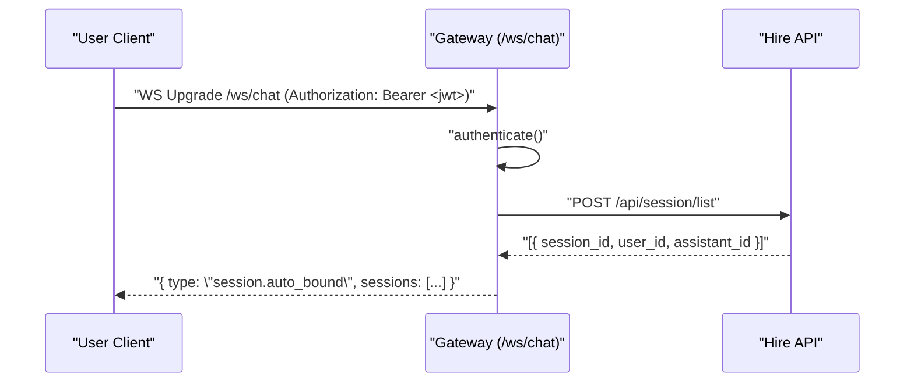
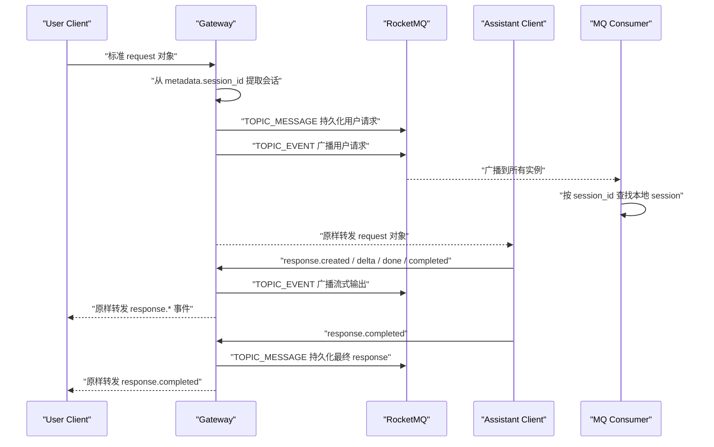

# Chat WebSocket 时序

本文档描述 `/ws/chat` 的实际交互流程。业务消息直接使用 Open Responses 风格的原生 JSON 对象，不再使用旧的 envelope 包装。

## 1. 连接与会话绑定



说明：

- 用户侧通过 JWT 鉴权。
- 助手侧通过 `x-app-key` 和 `x-app-secret` 鉴权。
- 网关连接成功后会自动查询该连接可见的 session 列表，并在内存中建立 `session_id -> socket` 映射。
- 如果自动绑定失败，也可以继续使用控制消息 `session.bind` 手动绑定 session。

## 2. 用户请求 -> 助手响应



## 3. 用户输入格式

用户侧应发送标准 request 对象：

```json
{
  "model": "your-model",
  "stream": true,
  "input": [
    {
      "type": "message",
      "role": "user",
      "content": [
        {
          "type": "input_text",
          "text": "你好，介绍一下你自己"
        }
      ]
    }
  ],
  "metadata": {
    "session_id": "sess_123456"
  }
}
```

关键点：

- `input` 必须是数组。
- `input[0].type` 使用 `"message"`。
- `input[0].role` 使用 `"user"`。
- 文本内容放在 `content[].type = "input_text"` 和 `content[].text` 中。
- 会话 ID 放在 `metadata.session_id` 中。

## 4. 助手输出格式

### 4.1 流式事件

```json
{"type":"response.created","response":{"id":"resp_123","object":"response","status":"in_progress","metadata":{"session_id":"sess_123456"}}}
{"type":"response.output_text.delta","response_id":"resp_123","delta":"你好，"}
{"type":"response.output_text.delta","response_id":"resp_123","delta":"我是一个 AI 助手。"}
{"type":"response.output_text.done","response_id":"resp_123","text":"你好，我是一个 AI 助手。"}
{"type":"response.completed","response":{"id":"resp_123","object":"response","status":"completed","output":[{"type":"message","role":"assistant","content":[{"type":"output_text","text":"你好，我是一个 AI 助手。"}]}],"output_text":"你好，我是一个 AI 助手。","metadata":{"session_id":"sess_123456"}}}
```

### 4.2 非流式完整响应

```json
{
  "id": "resp_123",
  "object": "response",
  "status": "completed",
  "output": [
    {
      "type": "message",
      "role": "assistant",
      "content": [
        {
          "type": "output_text",
          "text": "你好，我是一个 AI 助手。"
        }
      ]
    }
  ],
  "output_text": "你好，我是一个 AI 助手。",
  "metadata": {
    "session_id": "sess_123456"
  }
}
```

关键点：

- 推荐在 `response.created.response.metadata.session_id` 中带上 `session_id`。
- 最终 `response.completed.response.metadata.session_id` 也应包含 `session_id`。
- 中间 delta 事件如果未携带 `session_id`，网关会用 `response_id` 做会话续路由。

## 5. MQ 语义

- `TOPIC_EVENT`: 实时广播 topic。所有用户请求和助手输出事件都会发送到这里，供多实例互相转发。
- `TOPIC_MESSAGE`: 持久化 topic。
  - 用户请求进入网关时发送一次。
  - 助手最终完成时发送一次完整 response。

## 6. 错误约束

如果业务消息缺少 `metadata.session_id`，网关会拒绝处理并返回：

```json
{
  "error": {
    "type": "invalid_request",
    "code": "missing_required_parameter",
    "param": "metadata.session_id",
    "message": "The 'metadata.session_id' field is required."
  }
}
```

如果 payload 不是标准 request 对象，也不是标准 response / `response.*` 事件，网关会按非法请求拒绝。
